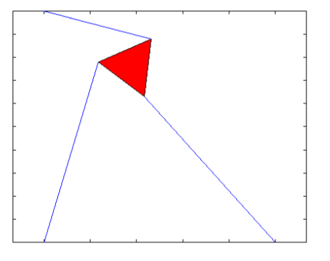

# polynomial-solver
Polynomial solver for delta robot

The problem this program solves is as follows: a triangular robot is attached by three actuator arms to a platform (the X-Y plane), and the lengths of the actuators can be changed to reach a desired position.
Given the lengths of the arms, what would be the final position of the robot?

